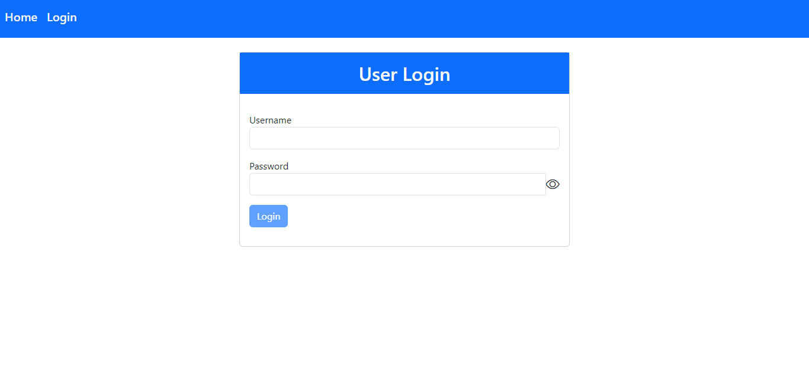

# LoginPage

Backend: 
Used Node + Express Js to connect to mysql database.

Start: npm start (runs in 3000)
_____________________________________________________________________________________________________________________________
LoginApp : Frontend Using Angular + Bootstrap

Start: npm start (runs in 4200: Default)

_____________________________________________________________________________________________________________________________
#Screenshots

